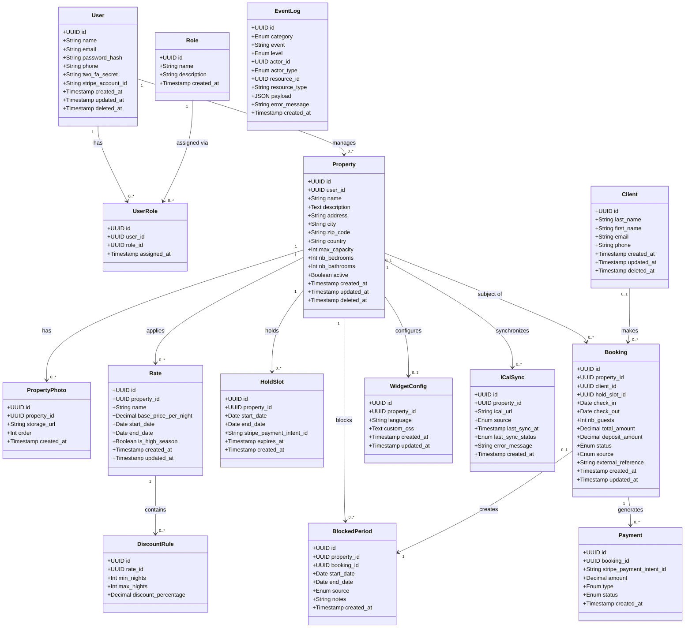

# Résa — Database model

> Note: the DB entity `User` is exposed as `Manager` in the API (see `docs/openapi.yaml`).
> `UserRole` is exposed as `ManagerRole`.

## Deliberate FK exceptions

- `BlockedPeriod.booking_id` has **no FK constraint** — it must survive booking purges.
- `EventLog.actor_id` / `EventLog.resource_id` have **no FK constraints** — logs must survive deletion of any entity.
- `Booking.property_id` and `Booking.client_id` are nullable: set to `NULL` only on permanent purge of the property/client (bookings are kept for history).
